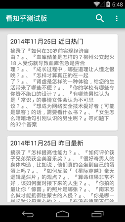
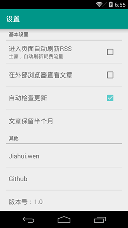

[看知乎][1] Android 客户端
==================

从[看知乎][1]这个网站读取RSS，在Android设备上阅读。

###Screenshots

###Run Unit Test
`gradle clean test`

###Open source library used
- [Butterknife][2]
- [Android Priority Job Queue][3]
- [EventBus][4]
- [Jsoup][5]
- [CursorRecyclerViewAdapter.java](7)
- [ParallaxRecyclerAdapter.java](8)
- [Android-ObservableScrollView](9)
- [material-dialogs](10)
- [robolectric][6](Unit Test)
- [android-appversion-gradle-plugin][13](apk rename)

###鸣谢
- [知乎网](11)
- [看知乎](12)
- 其他开源库的大牛们

## License

    Copyright 2014 Jiahui.wen

    Licensed under the Apache License, Version 2.0 (the "License");
    you may not use this file except in compliance with the License.
    You may obtain a copy of the License at

        http://www.apache.org/licenses/LICENSE-2.0

    Unless required by applicable law or agreed to in writing, software
    distributed under the License is distributed on an "AS IS" BASIS,
    WITHOUT WARRANTIES OR CONDITIONS OF ANY KIND, either express or implied.
    See the License for the specific language governing permissions and
    limitations under the License.

[1]:http://www.kanzhihu.com/
[2]:https://github.com/path/android-priority-jobqueue
[3]:https://github.com/JakeWharton/butterknife
[4]:https://github.com/greenrobot/EventBus
[5]:http://jsoup.org/
[6]:http://robolectric.org/
[7]:https://gist.github.com/skyfishjy/443b7448f59be978bc59
[8]:https://github.com/kanytu/android-parallax-recyclerview
[9]:https://github.com/ksoichiro/Android-ObservableScrollView
[10]:https://github.com/afollestad/material-dialogs
[11]:http://www.zhihu.com/
[12]:http://www.kanzhihu.com/
[13]:https://github.com/hamsterksu/android-appversion-gradle-plugin